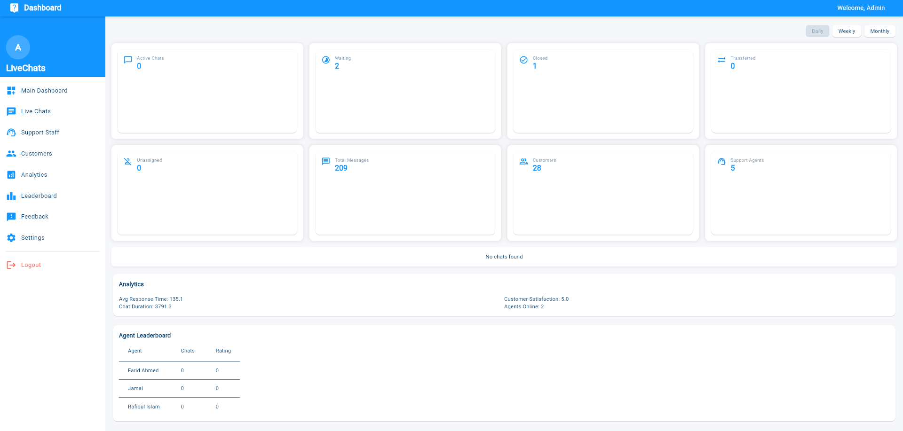
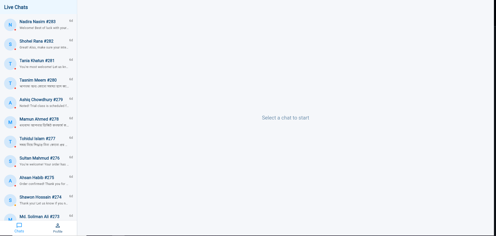
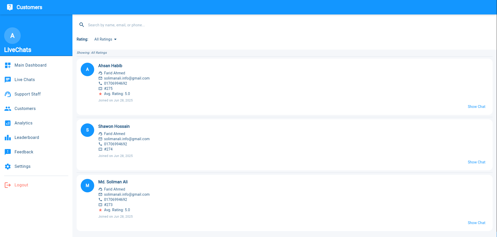
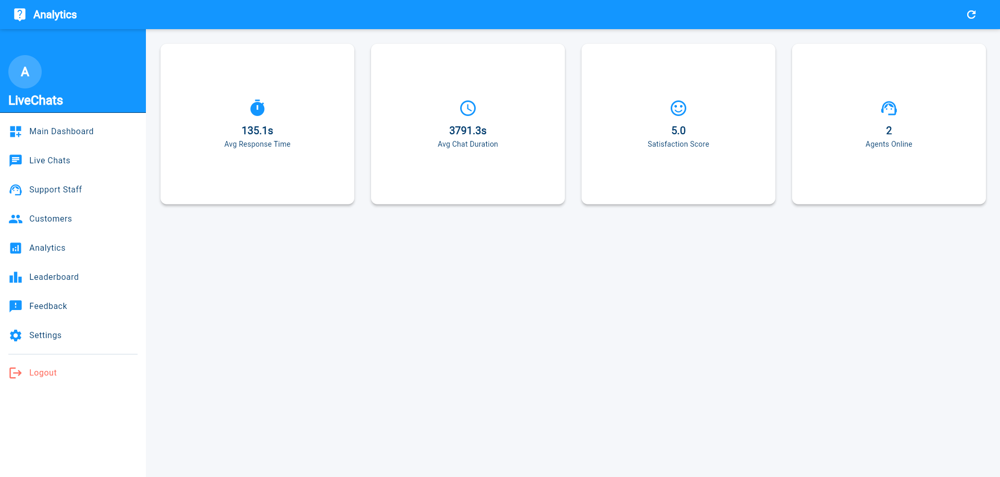
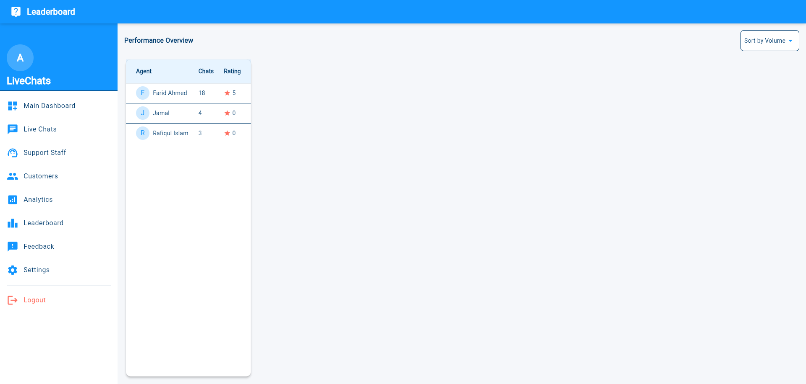

## 🛠️ Admin Dashboard

The **Admin Dashboard** provides a complete overview and control panel for managing your live chat support system. Only authenticated administrators can access this area.

---

### 🧾 Main Dashboard Overview

After login, the admin is taken to the **Main Dashboard**, which displays:

#### 📊 Summary Metrics

| Metric                | Description                                                |
|------------------------|------------------------------------------------------------|
| Active Chats           | Number of ongoing live chats                               |
| Waiting                | Chats pending agent assignment                             |
| Closed                 | Successfully ended chat sessions                           |
| Transferred            | Chats transferred from one agent to another                |
| Unassigned             | Chats that haven’t been picked up yet                      |
| Total Messages         | Total message exchanges across all chats                   |
| Customers              | Total number of users who started a conversation           |
| Support Agents         | Number of registered support staff                         |
| Analytics              | Summary of key performance indicators                      |
| Agent Leaderboard      | Agent performance overview                                 |

#### 📅 Time-Based Status

- View key metrics filtered by:
  - **Daily**
  - **Weekly**
  - **Monthly**

---

### 💬 Live Chats Menu

- Navigate to **Live Chats** → **Agent Chat Dashboard**
- Monitor all active conversations
- Track chat progress and agent availability in real time

---

### 🧑‍💼 Support Staff Menu

- View list of all registered support agents
- **Search & Filter** by name for quick access
- **Add New Support Staff** by filling the following fields:

| Field         | Description                                |
|---------------|--------------------------------------------|
| Full Name     | Agent's full name                          |
| Email Address | Login email for the support agent          |
| Password      | Secure password for access                 |
| Role          | Select: `Support` or `Admin`               |
| Account Status| Enable or Disable account on creation      |

> ✅ Click **Save** to register the new staff.

#### 🔧 Manage Existing Agents

- **Edit** agent info (name, email, role)
- **Lock** accounts temporarily
- **View Status**: Locked / Active

---

### 👥 Customers Menu

- View all customer sessions with:

| Info                         | Example                            |
|------------------------------|------------------------------------|
| Customer Name                | Md. Soliman Ali                    |
| Support Agent Name           | Farid Ahmed                        |
| Customer Email               | xyz@example.com                    |
| Ticket Number                | #300                               |
| Messaging Date               | Hoined on Jul 4, 2025              |

- **Search** by:
  - Name
  - Email
  - Phone
- **Filter by Rating**:
  - Use to identify chats with low satisfaction scores
  - View the full chat log to understand issues and improve quality

---

### 📈 Analytics Menu

Track key performance indicators (KPIs):

| Metric                  | Description                                     |
|--------------------------|------------------------------------------------|
| Avg. Response Time       | Average time taken to respond to a message     |
| Avg. Chat Duration       | Average duration of customer-agent chats       |
| Satisfaction Score       | Based on customer ratings post-chat            |
| Agents Online Summary    | Number and status of online agents             |

---

### 🏆 Leaderboard Menu

Performance overview for all support staff:

| Data Points              | Description                                 |
|--------------------------|---------------------------------------------|
| Agent Name               | Full name of the support staff              |
| Total Chats              | Number of chats handled by each agent       |
| Rating                   | Overall customer satisfaction rating        |

---

### ⚙️ Settings Menu

Customize admin preferences:

- Enable/Disable:
  - **Notifications**
  - **Sound alerts**

---

### 🚪 Logout

Once all tasks are completed, click **Logout** to safely exit the admin panel.

---

### ✅ Notes & Recommendations

- Use **search and filters** for faster navigation with large agent or customer bases.
- Regularly check **low-rated chats** for training and quality assurance.
- Keep your agent list **organized and active** by locking unused accounts.

> _The Admin Dashboard is your central control panel to ensure high-quality, responsive customer service at all times._

