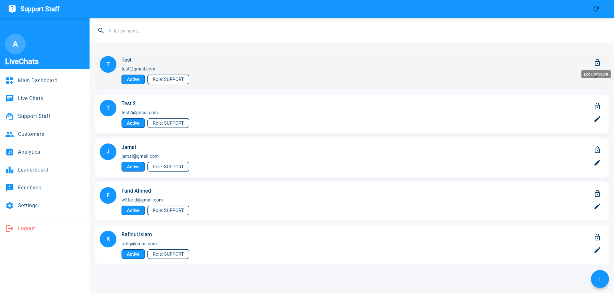
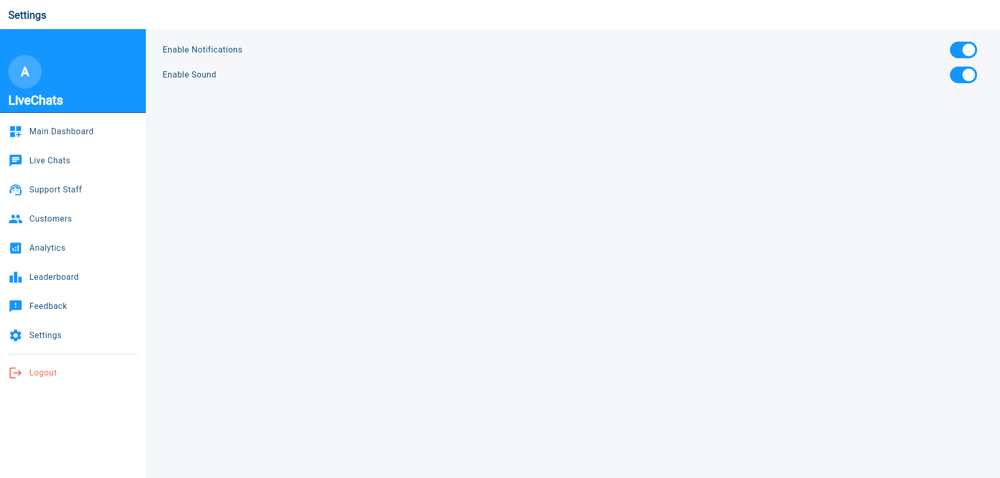

# Admin Dashboard – Full Documentation

The **Admin Dashboard** is the central control panel for managing your live chat support system. It empowers administrators to oversee all operational aspects including chat monitoring, staff management, performance analytics, and system preferences.

Only authenticated users with the **Admin** role can access this dashboard.

---

## 1. Accessing the Admin Dashboard

- Visit: [https://support.microdeets.com](https://support.microdeets.com)
- Log in using valid administrator credentials.
- You will be redirected to the **Main Dashboard** after login.

---

## 2. Main Dashboard Overview

### Summary Metrics

Displayed on login, this panel provides a quick glance at live system activity.

| Metric              | Description                                             |
|---------------------|---------------------------------------------------------|
| Active Chats        | Number of chats currently ongoing                       |
| Waiting             | Chats pending assignment to agents                     |
| Closed              | Sessions marked as completed                           |
| Transferred         | Chats handed over between agents                       |
| Unassigned          | Chats awaiting first response or agent pickup          |
| Total Messages      | All customer-agent message exchanges                   |
| Customers           | Count of users who initiated a chat                    |
| Support Agents      | Total registered agent accounts                        |
| Analytics           | Direct link to platform KPIs                           |
| Agent Leaderboard   | Snapshot of top-performing agents                      |

**Time Filter:** View metrics by **Daily**, **Weekly**, or **Monthly** timeframes.

---

## 3. Live Chats – Agent Monitoring

Navigate to:  
**Menu → Live Chats → Agent Chat Dashboard**

### Capabilities:
- View a list of all ongoing conversations
- Track agent availability and engagement
- Click into chats to observe or analyze in real time

---

## 4. Support Staff Management

Navigate to:  
**Menu → Support Staff**

### View Staff List
- List all registered agents with name, email, role, and status
- Search and filter by name or email

### Add New Support Agent

| Field           | Description                                |
|------------------|--------------------------------------------|
| Full Name       | Full name of the new agent                  |
| Email Address   | Email used for login                        |
| Password        | Secure login password                      |
| Role            | Choose between: `Support` or `Admin`       |
| Account Status  | Set to Enabled or Disabled during creation |

> Click **Save** to add the new agent.

### Manage Existing Agents
- **Edit** profile details (name, email, role)
- **Enable / Disable** login access
- **View Status**: Active, Locked, or Offline

---

## 5. Customer History and Session Logs

Navigate to:  
**Menu → Customers**

### Features:
- View all chat sessions with customer and agent info
- Search by **name**, **email**, or **phone number**
- Filter sessions by customer **rating score**

| Field                | Example                   |
|----------------------|---------------------------|
| Customer Name        | Md. Soliman Ali           |
| Support Agent        | Farid Ahmed               |
| Customer Email       | xyz@example.com           |
| Ticket Number        | #300                      |
| Messaging Date       | Joined on Jul 4, 2025     |

  

---

## 6. Analytics Dashboard

Navigate to:  
**Menu → Analytics**

Monitor system-wide KPIs to track performance and identify bottlenecks.

| Metric                  | Description                                            |
|--------------------------|--------------------------------------------------------|
| Avg. Response Time       | Average time to respond to messages                   |
| Avg. Chat Duration       | Average time spent per chat session                   |
| Satisfaction Score       | Based on customer feedback post-chat                  |
| Agents Online Summary    | Total agents active, idle, or offline                 |

---

## 7. Agent Leaderboard

Navigate to:  
**Menu → Leaderboard**

This section ranks agents by performance based on chat volume and customer ratings.

| Metric            | Description                            |
|-------------------|----------------------------------------|
| Agent Name        | Full name of the support staff         |
| Total Chats       | Number of chats handled                |
| Rating            | Average satisfaction score (1–5 stars) |

---

## 8. System Preferences

Navigate to:  
**Menu → Settings**

Customize global system preferences for the admin environment.

### Options:
- Enable/Disable:
  - Desktop notifications
  - Sound alerts for incoming messages

---

## 9. Logout

After completing administrative tasks, click the **Logout** button to securely end your session.

---

## 10. Best Practices & Tips

- Regularly **review closed chats** with low ratings to improve service quality.
- Use **search and filters** to locate specific sessions quickly.
- Keep support staff lists up to date by **locking inactive accounts**.
- Use analytics to identify peak chat hours and allocate agents accordingly.
- Encourage support staff to maintain **accurate status** (Online, Busy, Offline) for efficient routing.

---

## Summary

The Admin Dashboard gives you full control over your customer support workflow. From managing agents and monitoring chats to analyzing performance, this dashboard helps ensure high-quality service delivery across your organization.

For further customization or technical setup, please refer to the [Developer Integration Guide](./developer_integration.md) or contact your system administrator.
