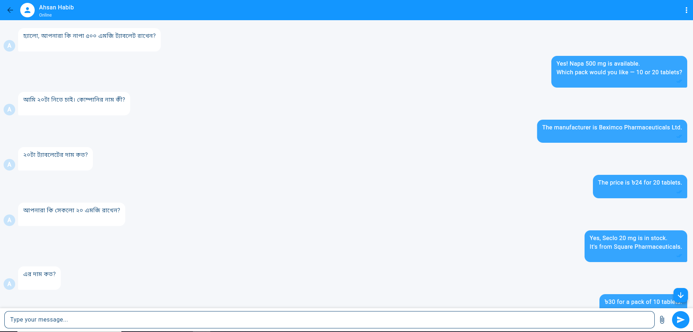

# Customer Support Agent Dashboard – User Guide

The **Customer Support Agent Dashboard** is the central hub for managing live customer conversations. Designed with speed, clarity, and productivity in mind, it empowers support agents to handle real-time inquiries with confidence and efficiency.

---

## 🚪 Accessing the Dashboard

- Accessible immediately after successful login.
- Agents are directed to the **Chats** tab by default.
- New and ongoing conversations appear in real time.

---

## 🗂️ Chats Tab Overview

The **Chats** tab is your primary workspace. It gives you full visibility into all customer conversations and tools to manage them effectively.

### 📌 Key Features

| Feature               | Description                                                                 |
|------------------------|-----------------------------------------------------------------------------|
| **Incoming Chats**     | Displays real-time queue of customer messages                              |
| **Join as Support**    | Allows agents to join a chat and begin supporting                          |
| **Real-Time Messaging**| Send and receive instant messages without page refresh                     |
| **Customer Status**    | Indicates whether a customer is **Online** or **Offline**                  |
| **Send Attachments**   | Upload and share files (screenshots, documents, etc.)                      |
| **Close Chat**         | End a session once the issue is resolved                                   |
| **Transfer Chat**      | Reassign the conversation to another available agent                       |

---

## 🧭 Step-by-Step Usage Guide

### 1. Log In
- Go to [support.microdeets.com](https://support.microdeets.com)
- Enter your support agent credentials
- You will land on the **Agent Dashboard**

---

### 2. Monitor Incoming Chats
- Navigate to the **Chats** tab
- View customer messages with name, preview, timestamp, and status indicators

---

### 3. Join a Chat Session
- Click **Join as Support** on any incoming conversation
- This assigns you as the primary agent for the session

---

### 4. Begin Live Chat
Once joined, you can:
- Communicate with the customer in real time
- See when the customer is typing or has gone offline
- Upload relevant documents or screenshots using the attachment button

---

### 5. Resolve or Transfer the Conversation
- When the issue is resolved:
  - Click **Close Chat**
  - The customer will be prompted to rate the session and leave comments
- If you need to involve another agent:
  - Use **Transfer Chat** to assign it to a colleague

---

## 🖼️ Visual Reference


*Figure 1: Chat Overview Interface*


*Figure 2: In-Chat Messaging View*

---

## 🔄 Chat Lifecycle Flow

```plaintext
Incoming Chat → Joined by Agent → In Progress 
                        ↓
                (Transferred if needed) → Closed (Customer Review)
