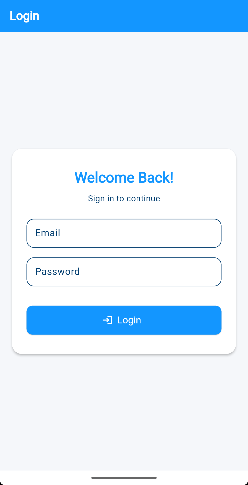

## <i class="fa-solid fa-right-to-bracket"></i> Login

The **Login** functionality allows registered users to access their account using valid credentials.

### <i class="fa-solid fa-location-dot"></i> Where to Find It

- URL: `https://support.microdeets.com`  

### <i class="fa-solid fa-desktop"></i> Login Page Overview

The login page consists of the following fields:

| Field         | Type     | Required | Description                      
|---------------|----------|----------|---------------------------------- 
| Email         | Text     | ✅       | The user’s registered email 
| Password      | Password | ✅       | The user’s account password      

### <i class="fa-solid fa-circle-check"></i> How to Use

1. Navigate to the **Login Page**.
2. Enter your **Email** and **Password** in the appropriate fields.
3. Click the **"Login"** button.
4. If the credentials are valid, you will be redirected to the dashboard.
5. If credentials are incorrect, an error message will appear.

### <i class="fa-solid fa-rotate"></i> Error Handling

- **Invalid Email or Password**: A message will display informing the user to recheck their credentials.
- **Empty Fields**: The form may prevent submission until all required fields are filled.

### <i class="fa-solid fa-lock"></i> Security Features

- Password input is hidden by default.
- Token-based or session-based authentication is typically used on the backend (implementation-dependent).
