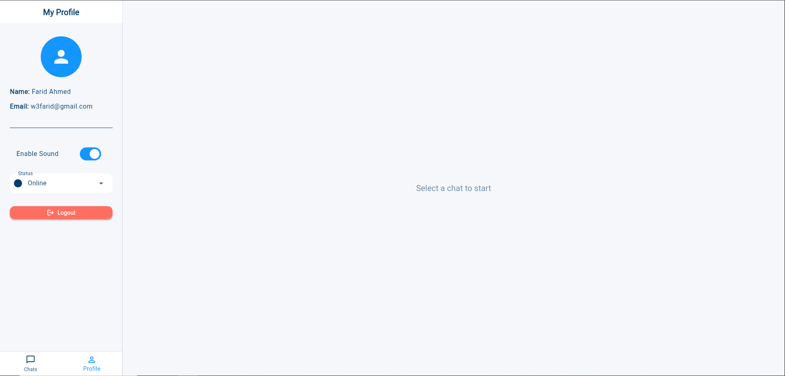

# Profile – Customer Support Agent Dashboard

The **Profile** tab allows support agents to manage their personal preferences and view basic account details. It is designed to give agents control over their notification settings, availability status, and logout options in one simple interface.

---

## Accessing the Profile

- Once logged in, navigate to the top or side navigation bar.
- Click on the **Profile** tab to open your profile settings.

---

## Profile Section Overview

The Profile panel provides the following fields and controls:

| Field               | Type             | Description                                                                 |
|---------------------|------------------|-----------------------------------------------------------------------------|
| **Name**            | Text (Read-only) | Displays the full name of the logged-in support agent                      |
| **Email**           | Text (Read-only) | Shows the registered email address used for login                          |
| **Sound Notification** | Toggle (On/Off) | Enables or disables sound alerts for incoming customer messages            |
| **Status**          | Dropdown Menu     | Allows agents to update their current availability status:                 |
|                     |                  | - **Online** – Ready to accept chat requests                               |
|                     |                  | - **Busy** – Temporarily unavailable (chat requests paused)                |
|                     |                  | - **Offline** – Fully unavailable; removed from routing                    |
| **Logout**          | Button            | Ends the current session and logs the agent out of the dashboard           |

---

## Step-by-Step Instructions

### 1. Open Your Profile
- Click on **Profile** in the navigation menu.

### 2. Review Personal Information
- View your **Name** and **Email** (these fields are not editable).

### 3. Adjust Notification Settings
- Use the **Sound Notification Toggle** to enable or disable sound for incoming chats.

### 4. Set Your Availability
- Use the **Status Dropdown** to update your status based on your availability:
  - **Online**: Available for chats
  - **Busy**: You will not receive new chats but can finish existing ones
  - **Offline**: You are unavailable and will be excluded from chat routing

### 5. Log Out
- Click the **Logout** button to safely exit the platform and end your session.

---

## Visual Example

*Figure: Example of a profile settings screen*

---

## Best Practices

- Keep your **status** updated throughout the day to reflect your availability.
- Use **sound notifications** to avoid missing new messages while multitasking.
- Always click **Logout** at the end of your shift to secure your session.

---

For profile update requests (e.g., name or email change), please contact your system administrator.
